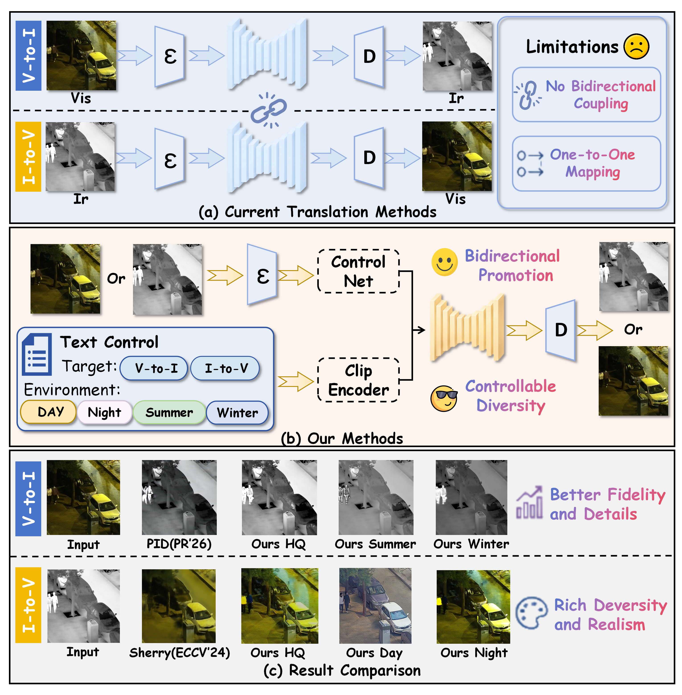
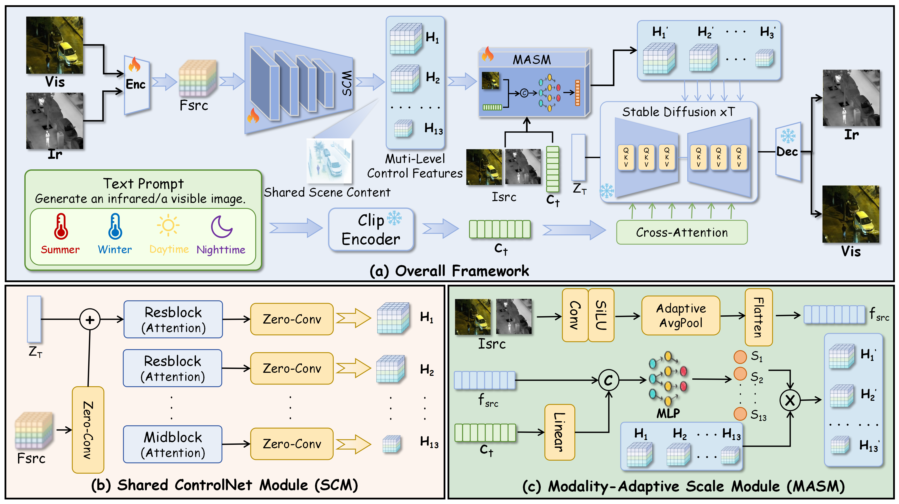

<div align="center" style="text-decoration: none !important;">
  <h1>
    <a href="https://github.com/HaoZhang1018/CoBiTrans" target="_blank" style="text-decoration: none !important;">
      CoBiTrans: Controlled Bidirectionally Promoted Diffusion for Visible–Infrared Image Translation
    </a>
  </h1>

  <div>
	<a href="https://github.com/HaoZhang1018" target="_blank">Hao Zhang<sup>1*</sup></a>,&emsp;
	<a href="https://github.com/Echohym" target="_blank">Yumin Huang<sup>1*</sup></a>,&emsp;
	<a href="https://github.com/Leiii-Cao" target="_blank">Lei Cao<sup>1</sup></a>,&emsp;
	Erting Pan<sup>2</sup>,&emsp;
	<a href="https://sites.google.com/site/jiayima2013" target="_blank">Jiayi Ma<sup>1&#8224;</sup></a>
  </div>

 <div>
    <sup>1</sup>Wuhan University &emsp;
    <sup>2</sup>National University of Defense Technology
  </div>
  <div>
    <sup>*</sup>Equal Contribution &emsp;
    <sup>&#8224;</sup>Corresponding Author
  </div>
</div>

## 🔎 Method Overview

### 💡 Motivation



### 🖼️ Framework



## 🛠️ Create Environment

1. **Clone this repository:**

   ```bash
   git clone https://github.com/HaoZhang1018/CoBiTrans.git
   cd CoBiTrans
   ```

2. **Create a Conda environment (recommended):**

   ```bash
   conda create -n cobitrans python=3.10 -y
   conda activate cobitrans
   ```

3.  **Install dependency packages:**
    
    ```bash
	pip install -r requirements.txt
	```
    
 ## 📥 Pre-trained Weights

The pretrained weights of CoBiTrans are available on [Baidu Netdisk](https://pan.baidu.com/s/1Zb6VYej8LXBtjSfp0T-j1w?pwd=hhym) (extraction code: `hhym`).
Please place the downloaded files in the following directory:

```text
CoBiTrans/
├── models/
│   ├── cldm_v21.yaml
│   ├── control_sd21_ini.ckpt
│   └── open_clip_model.safetensors
└── checkpoints/
    └── last.ckpt
```

## 🗂️ Dataset Preparation

The current data loader reads training samples from `dataset/train.json` and loads source and target images from the following folders:

```text
CoBiTrans/
├── dataset/
│   ├── train.json
│   └── test.json
├── dataset_source/
├── dataset_control/
└── dataset_enhance/
```

A training JSON file can be organized as follows:

```json
{
  "data": [
    {
      "source": "visible/000001.jpg",
      "target": "infrared/000001.jpg",
      "prompt": "Generate an infrared image. Summer."
    },
    {
      "source": "infrared/000001.jpg",
      "target": "visible/000001.jpg",
      "prompt": "Generate a visible image. Daytime."
    }
  ]
}
```

For paired bidirectional synchronous training, place the VIS-to-IR and IR-to-VIS samples of the same scene consecutively in `train.json`.

Supported prompt forms include:

```text
Generate an infrared image.
Generate an infrared image. Summer.
Generate an infrared image. Winter.
Generate a visible image.
Generate a visible image. Daytime.
Generate a visible image. Nighttime.
```

## 🔥 Training

Edit the configurations in `tutorial_train.py`, including `resume_path`, `gpu_ids`, `batch_size`, `learning_rate`, and checkpoint settings. Then run:

```bash
python tutorial_train.py
```

The training script uses distributed data parallel training and a consecutive distributed sampler to preserve the paired bidirectional sample order.

## 🧪 Testing

Edit the following paths at the beginning of `test.py`:

```python
config_path = "./models/cldm_v21.yaml"
ckpt_path = "./checkpoints/last.ckpt"
json_path = "./dataset/test.json"
data_root = "./dataset"
save_dir = "./results"
```

Run inference with:

```bash
python test.py
```

The translated images will be saved under `save_dir` while preserving the relative target paths defined in `test.json`.
